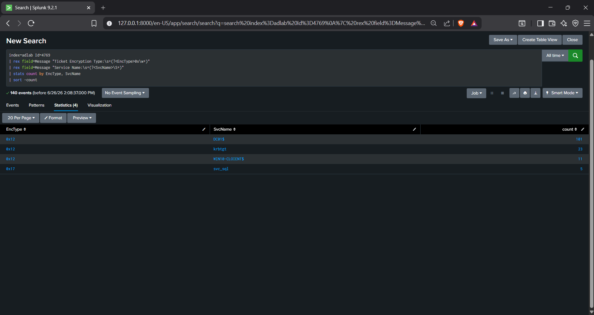

# AD DFIR Lab — Golden Ticket Attack Chain

Controlled lab environment. Simulated Kerberoasting → Golden Ticket → data
access attack, detected and investigated using Wazuh (real-time SIEM),
Windows Event Viewer / Sysmon (host forensics), and Splunk (retrospective
log analysis).

## The finding that matters most

Out of 140 Kerberos service ticket requests captured during the incident
window, exactly 5 used weak RC4 encryption — and all 5 targeted the same
account (`svc_sql`). That's the anomaly that isolates the attack from
normal traffic, found by pivoting raw logs in Splunk:

## Attack timeline

| Time | Phase | Evidence | Detected |
|---|---|---|---|
| 2026-05-15 11:52–12:48 | Kerberoasting — 5 RC4 requests vs. `svc_sql` | Event 4769 | ✅ Wazuh Rule 100001 |
| 2026-05-13 18:57 | Golden Ticket forged — 10-year TGT lifetime | `klist` | ✅ Wazuh Rule 100003 |
| 2026-05-13 | SMB share access (`\\DC01\HR`), forged identity | Event 5140 | Logged |
| 2026-05-13 12:43 / 2026-05-16 10:49 | HR file read (`employees_confidential.txt`) | Event 4663 | ✅ Wazuh Rule 100004 |

Full reconstruction, MITRE ATT&CK mapping, and detection-gap analysis: [`docs/IR_Report_GoldenTicket.md`](docs/IR_Report_GoldenTicket.md)

## What this demonstrates

- Cross-source correlation: a SIEM alert, an Event Viewer entry, and a
  Splunk query all describing the same 5 events, independently
- A real detection gap, found and documented rather than glossed over: the
  credential-extraction technique used here (`secretsdump` via DRSUAPI)
  never touches LSASS memory, so the LSASS-monitoring rule did not fire
  during the actual attack — only when separately tested with a different
  technique
- Custom detection engineering: 5 Wazuh rules, MITRE-mapped, tuned against
  a measured baseline (zero false positives across normal `alice.hr` /
  `bob.it` activity)

## What I learned building this

A few things didn't go as planned, and the troubleshooting taught me more
than the parts that worked on the first try:

- **Clock skew breaks Kerberos silently, and the error message doesn't
  tell you that.** My first Kerberoasting attempts failed with generic
  auth errors. The actual cause was DC01 and Kali reporting time in
  different timezones, so what looked like a 20-second gap was really a
  5–6 hour one. Kerberos has a hard clock-tolerance requirement that NTLM
  doesn't, which is also why switching to NTLM-based auth was the right
  troubleshooting move, not just a workaround.

- **Not every credential-theft technique touches the artifact you're
  watching for.** I assumed `secretsdump` would trigger my LSASS-access
  detection rule (Sysmon Event 10) since that's the classic
  credential-dumping signature. It didn't — DRSUAPI-based extraction talks
  to the domain replication service over the network and never opens
  `lsass.exe`'s memory. I only found this out by checking the Sysmon log
  directly and seeing nothing there, then had to use a different technique
  (`comsvcs.dll` MiniDump) just to prove the rule itself worked. The gap
  this exposes is real: my detection coverage for credential theft was
  weaker than I assumed until I tested it end-to-end instead of trusting
  that "I have a rule for that" meant "I'd catch it."

- **Evidence can contradict itself, and you have to be the one who
  catches it.** While organizing screenshots for this README, I found two
  different Golden Ticket captures from two different forging attempts —
  one with a normal-looking ~5 month expiry, one with the actual 10-year
  anomaly my detection rule is built around. Using the wrong one would
  have quietly undermined my own report. Re-checking timestamps across
  every artifact before publishing caught it.

- **A SIEM alert and a raw log pivot table can tell the same story two
  different ways, and that's useful, not redundant.** Wazuh told me in
  real time that one Kerberoasting alert fired. Going back into Splunk
  and pivoting the same window showed *why* it mattered: 135 normal AES
  requests against routine accounts, and exactly 5 RC4 requests, all
  against one account. The real-time alert says "something happened";
  the retrospective pivot says "and here's how unusual it actually was."
  I didn't fully understand why a SOC workflow would use both until I'd
  done both myself.

## Stack
`Windows Server 2022` · `Wazuh 4.7` · `Splunk Enterprise` · `Sysmon` ·
`BloodHound` · `Impacket`

## Note
This is a controlled lab built to learn and demonstrate the attack chain
and the detection engineering behind it — not a production incident.
